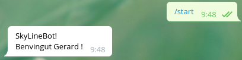
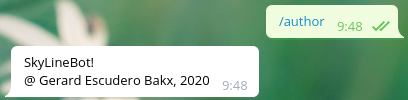
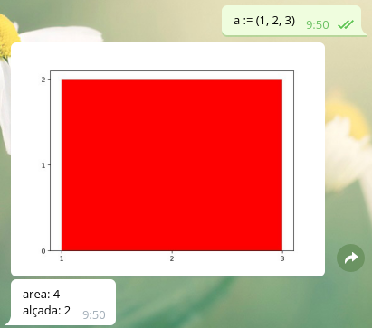
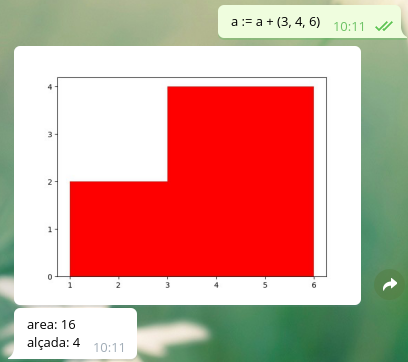
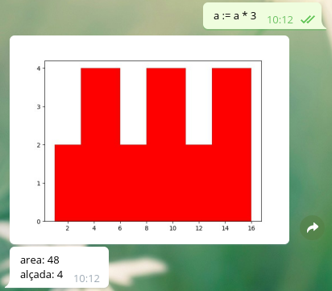
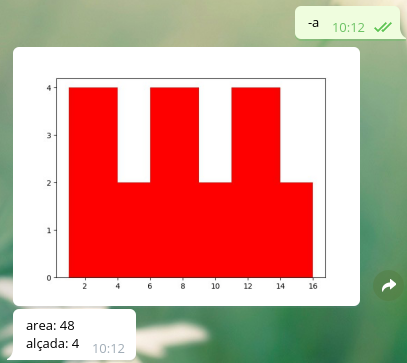

# SkylineBot

El projecte SkylineBot per GEI-LP (edició primavera 2020).

<center></center>

<center>L'_skyline_ d'una ciutat mostra una vista horizontal dels seus edificis.</center>

L'objectiu general de la pràctica consisteix en desenvolupar un chatbot intèrpret en 
_telegram_ per a la manipulació d'_Skylines_.

## Llenguatge
=======
<centerL'_skyline_ d'una ciutat mostra una vista horizontal dels seus edificis.</center>

L'objectiu general de la pràctica consisteix en desenvolupar un chatbot intèrpret en 
_telegram_ per a la manipulació d'_Skylines_.

## Llenguatge

A continuació teniu un petit exemple del que s'espera que faci el chatbot:


Abans de començar a detallar el que s'espera anem a veure un exemple 
d'interacció amb el nostre chatbot intèrpret.

### Exemple d'interacció

A continuació teniu un petit exemple del que s'espera que faci el chatbot:


La comanda `/start` s'encarrega de fer totes les inicialitzacions pertinents i
donar el missatge de benvinduda.



La comanda `/author` ens dona la informació sobre l'autor del bot.



Amb l'expressió `(1, 2, 3)` estem creant un edifici que va desde la posició x 
1 a la 3 i que té una alçada de 2. Amb l'operador `:=` estem assignant l'edifici
a l'identificador `a`. De fet, estem creant una skyline amb un únic edifici.

El resultat que dona l'intèrpret és una representació de l'skyline juntament amb
el comput de la seva àrea i alçada.



En aquest cas estem afegint un edifici nou `(3, 4, 6)` a l'skyline anterior 
mitjançant l'operador `+`.



Amb l'operador `*` i un nombre natural podem replicar l'edifici tantes vegades
com especifiquem.



També podem reflectir una skyline. Noteu que en aquest cas no estem assignant 
res, només preguntant pel resultat d'una expressió.

### Notació del llenguatge

El llenguatge permet els tipus següents d'operacions:

- Creació d'edificis:
  - Simple: `(xmin, alçada, xmax)` on `xmin` i `xmax` especifiquen la posició
d'inici i final a la coordenada horizontal i `alçada` l'alçada de l'edifici. 
Ex: `(1, 2, 3)`
  - Compostos: `[(xmin, alçada, xmax)]` permet definir diversos edificis 
mitjançant una llista d'edificis simples. Ex: `[(1, 2, 3), (3, 4, 6)]`

En la creació d'edificis s'ha de control·lar que `xmax` sigui més gran que 
`xmin` i que no posem edificis en valors de `x` negatius.

- Operadors d'skylines:
  - `skyline + skyline`: unió
  - `skyline * skyline`: intersecció
  - `skyline * N`: replicació `N` vegades de l'skyline (vegeu exemple 
d'interacció).
  - `skyline + N`: desplaçament a la dreta de l'skyline `N` posicions.
  - `skyline - N`: desplaçament a l'esquerra de l'skyline `N` posicions. 
  - `- skyline`: retorna l'skyline reflexat.

La taula següent mostra la prioritat d'operadors de més gran a més petita:

*operador* | *descripció*
--- | ---
`( )` | parèntesis
`-` | mirall
`*` | intersecció i replicació
`+` `-` | unió i desplaçaments

El llenguatge admet l'ús d'*identificadors* i l'*assignació* mitjançant l'operador
`:=`.

## Tasques

La vostra pràctica ha de contenir els components que es detallen a continuació.

### Gramàtica

Definiu la part lèxica (tokens) i sintàctica (gramàtica). Feu la gramàtica 
per a que ANTLR4 pugui reconèixer-la. La regla inicial de la gramàtica és:

```
grammar Skyline;
...
```

### Classe Skyline

Dissenyeu una classe `Skyline` per a la gestió dels _skylines_. 

Heu de tenir en compte que cap operació tingui un cost quadràtic.

### Visitor

Definiu un visitor per a l'avaluació d'expressions del llenguatge descrit 
anteriorment.

Nota: haure d'utilitzar algun tipus de taula de símbols per gestionar les 
assignacions i identificadors.

### Telegram

La vostra tasca consisteix en implementar un Bot de Telegram que interactui
textualment i gràficament amb els components que es detallen a continuació.

Noteu que les dades han de ser guardades per a cada usuari. El bot ha de
funcionar amb diversos usuaris treballant al mateix temps.

#### Comandes del bot

El vostre Bot ha d’entendre i contestar correctament les comandes següents:

- `/start` inicia la conversa amb el Bot.
- `/help` el Bot ha de contestar amb una llista de totes les possibles comandes i
una breu documentació sobre el seu propòsit i ús.
- `/author` el Bot ha d’escriure el nom complet de l’autor del projecte i seu correu
electrònic oficial de la facultat.
- `/lst`: mostra els identificadors definits i la seva corresponent àrea.
- `/clean`: esborra tots els identificadors definits.
- `/save id`: ha de guardar un skyline definit amb el nom 'id.sky'.
- `/load id`: ha de carregar un skyline de l'arxiu 'id.sky'.

#### Intèrpret 

Feu un intèrpret que interactui amb l'usuari com a l'exemple mostrat a l'inici 
del document.


## Llibreries

Utilitzeu les llibreries de Python següents:

- `matplotlib` per graficar dades.
- `pickle` per guardar i carregar estructures de dades en binari.
- `python-telegram-bot` per interactuar amb Telegram.

Podeu utilitzar lliurament altres llibreries estàndards de Python, però si no 
són estàndards, heu de demanar permís als vostres professors (que segurament no
us el donaran).

## Referències

- Matplotlib. The Matplotlib development team. 2018.
https://matplotlib.org/
- pickle — Python object serialization. Python Software Foundation. 2019.
https://docs.python.org/3.6/library/pickle.html
- Bots de Telegram. Jordi Petit. 2019.
https://lliçons.jutge.org/python/telegram.html

## Lliurament

Heu de lliurar la vostra pràctica al Racó. Només heu de lliurar un fitxer ZIP
que, al descomprimir-se generi:
- un fitxer _requirements.txt_ amb les llibreries que utilitza el vostre projecte
  - vegeu, per exemple, https://pip.pypa.io/en/stable/user_guide/#requirements-files.
- un fitxer _README.md_ que el documenti
  - vegeu, per exemple, https://gist.github.com/PurpleBooth/109311bb0361f32d87a2.
- una carpeta _cl_ amb el contingut de la part de compiladors
  - els arxius principals s'han de dir _test.*.py_
- un arxiu _bot.py_ amb la part del chatbot
- un arxiu _Skyline.py_ amb la classe Skyline

Els vostres fitxers de codi en Python han de seguir les regles d’estı́l PEP8,
tot i que podeu oblidar les restriccions sobre la llargada màxima de les lı́nies.
Podeu utilitzar el paquet pep8 o http://pep8online.com/ per assegurar-vos
que seguiu aquestes regles d’estı́l. L’ús de tabuladors en el codi queda prohibit
(zero directe).

El termini de lliurament és el dilluns 8 de juny a les 23:59.
